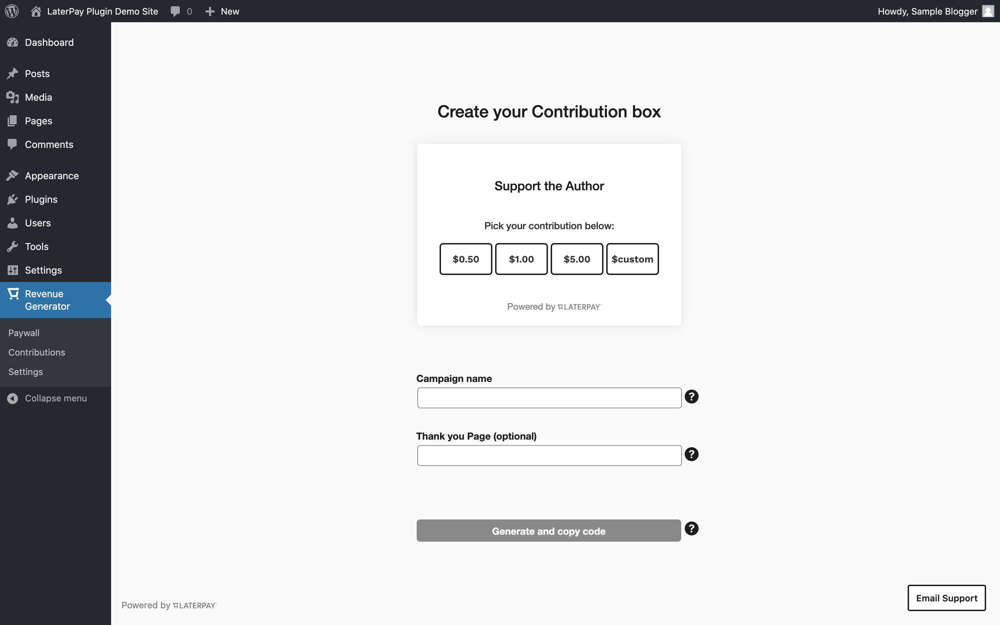

<h1 align="center"> Revenue Generator by Laterpay </h1>

[](https://www.repostatus.org/#wip)
[](https://github.com/laterpay/revenue-generator/blob/master/LICENSE)

##### Revenue Generator is the official WordPress plugin for selling digital content using Laterpay’s patented [Pay Later model](https://www.laterpay.net/blog/how-to-laterpay-dos-and-donts-from-8-years-expertise).
<hr/>

### Table of Contents

- [Installation](#installation)
- [Contributing](#contributing)
- [Development Notes](#development-notes)
			- [Please run the following commands from the root directory of this repository.](#please-run-the-following-commands-from-the-root-directory-of-this-repository)
- [Project Folder / File Structure](#project-folder--file-structure)
- [Terminology](#terminology)
		- [Payment Options](#payment-options)
		- [Payment Models](#payment-models)
- [Screenshots](#screenshots)
	- [Welcome screen](#welcome-screen)
	- [Onboarding tutorial](#onboarding-tutorial)
	- [Paywall preview](#paywall-preview)
	- [Add purchase option](#add-purchase-option)
	- [Paywall Dashboard](#paywall-dashboard)
	- [Published paywall](#published-paywall)
	- [Create Contribution](#create-contribution)
	- [Published Contribution](#published-contribution)
- [Versioning](#versioning)
- [Copyright](#copyright)

## Installation

The latest release of the plugin is available [here](https://github.com/laterpay/revenue-generator/releases/latest).

- Install the latest zip or use the latest code from `master` branch in your test site.
- Activate the plugin and select `Revenue Generator` in the menu.
- Go through the on-boarding tutorial to get an overview of the available features.
- Once you have your first paywall set up, click “Publish.” You will be asked to connect your [Laterpay account](http://laterpay.net/) (only asked once).
- You should now see the paywall has been created.

## Contributing

1. Fork it [here](https://github.com/laterpay/revenue-generator/fork).
2. Run `composer install` to install all the dependencies, mainly used for linting `PHP` code
3. Run `npm install` to install all the dependencies, mainly used for building/compiling plugin assets
4. Create your feature branch (`git checkout -b feature/my_new_feature develop`)
5. Add your changes, verify coding standards and PHP compatibility ( [Check Development Notes](#Development Notes) )
6. Run `npm run build` for `js` and / or `css` changes. Please check [package.json](package.json) for more development scripts
7. Commit your changes ( eg. `git commit -am 'Add support for feature x'`)
8. Push to the branch (`git push origin feature/my_new_feature`)
9. Create a new Pull Request to `develop`

## Development Notes

##### Please run the following commands from the root directory of this repository.

1. Please verify your code is in compliance to the Coding Standards used in this Project.
2. Run `composer phpcs filename` or `composer phpcs` to check for PHPCS errors/warnings.
3. Run `composer phpcsbf filename` or `composer phpcbf` to automatically fix possible PHPCS errors/warnings.
4. Run `composer phpcompat` to check if the code is compatible for PHP 5.6 and above.
5. Run `npm run build` to build production build assets.
6. Run `npm run dev` to keep the build process running while making changes to assets.
7. Run `npm run lint:js` to to check for JS errors/warning.
8. Run `npm run lint:js:fix` to automatically fix possible errors/warning in JS code.
9. Run `npm run language` to update project the po file.
10. Run `npm run zip` to create a final zip with production assets.

## Project Folder / File Structure

```text
revenue-generator
├── assets
|   ├── build             ( Plugin build assets )
│   └── src               ( Plugin source assets )
├── bin
├── inc
│   ├── classes           ( Common classes )
│   │   └── post-types    ( Custom CPT classes )
│   ├── helpers           ( Helper classes )
│   └── traits            ( Traits classes )
├── languages             ( Language files for translation )
├── templates             ( Markup templates used around the plugin )
│   └── backend           ( Markup templates used in admin area )
├── tests                 ( Automated tests )
├── wporgassets           ( WordPress / Github assets )
├── LICENSE               ( Project LICENSE )
├── README.md             ( Project README.md )
├── phpcs.xml             ( Project PHPCS ruleset )
├── phpunit.xml           ( Project PHPUNIT ruleset )
├── uninstall.php         ( Plugin uninstall file )
└── revenue-generator.php ( Plugin main file )
```

## Terminology

#### Payment Options

- **Paywall** - A Paywall consists of several purchase options including single purchases, time passes and subscriptions. It is used to add pricing to your site's content.
<hr/>

- **Single Purchase** - A single purchase grants a customer infinite access to a single piece of content and can be sold as “Buy Now, Pay Later” and “Buy Now.”
<hr/>

- **Subscription** - A subscription grants a customer access for a specified period of time; it will automatically renew until the user cancels. Subscriptions are only available as “Buy Now.”
<hr/>

- **Time Pass** - A time pass grants a customer access to a resource for a set amount of time; they do not auto-renew. Time passes can be sold as “Buy Now, Pay Later” and “Buy Now.”

#### Payment Models

- **Pay Later** - When a customer purchases “Pay Later” content, the item is added to their Laterpay Tab and they will be asked to pay once they hit the threshold of 5€ or $5. Pay Later items can be priced between 0.05€ and 5.00€ and between $0.05 and $5.00.
<hr/>

- **Pay Now** - The “Pay Now” model is a traditional payment model which requires a customer to pay immediately. Pay Now items can be priced between 1.00€ and 1,000.00€ and between $1.99 and $1,000.00.

## Screenshots ##

### Welcome screen


### Onboarding tutorial


### Paywall preview


### Add purchase option


### Paywall Dashboard


### Published paywall


### Create Contribution



### Published Contribution


## Versioning

The Revenue Generator plugin uses [Semantic Versioning 2.0.0](http://semver.org)

## Copyright

Copyright 2020 Laterpay GmbH – Released under MIT [LICENSE](LICENSE).
